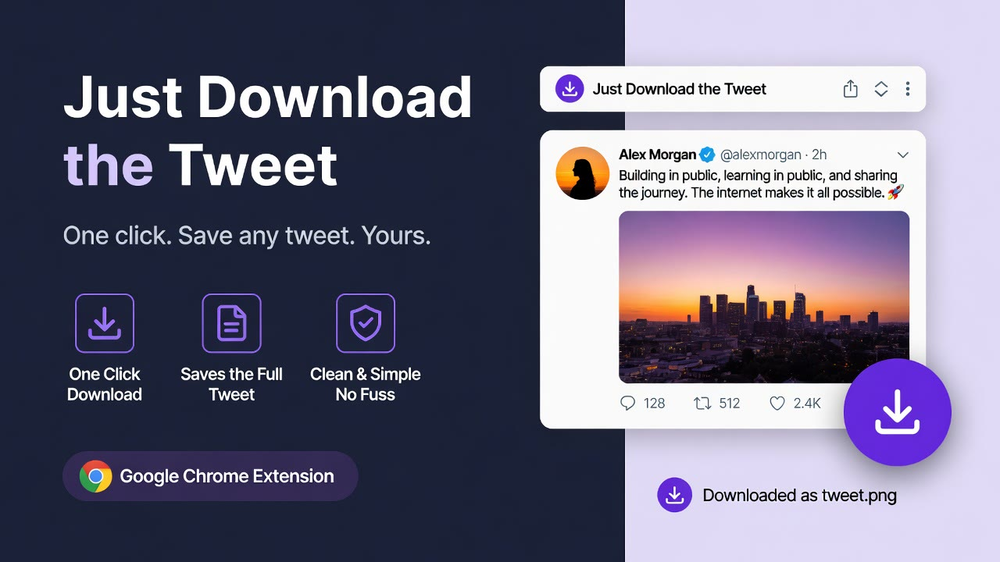

<div align="center">

# Just Download The Tweet

**Keep the media. Skip the screenshots.**

A Chrome extension (Manifest V3) that adds one-click download controls to posts with media on X.

`License: MIT` · `Platform: Chrome 116+ · MV3` · `Version: 0.1.8` · `UI: 51 locales` · `No servers in the loop`

</div>


## What it is

Just Download The Tweet adds a small download control to every X post that carries media. One click saves the single item; posts with several items open a menu with **Download all** and **Download ZIP**. Media is resolved from X's own timeline payloads, so photos come in original resolution and videos in the best MP4 variant X offers.

| Feature | What it does |
|---|---|
| One-click downloads | A download button joins the post's action bar (like, repost, ...) — nothing moves. |
| Original photos | Rewrites X image URLs to the `orig` variant. |
| Best video / GIF | Picks the highest-bitrate MP4 from the video manifest. |
| Multi-media menu | Per-item download, Download all, or a single ZIP archive. |
| 51 locales | UI strings follow your browser language via `chrome.i18n`. |
| Zero backend | Files go from X's CDN straight to your Downloads folder. No intermediary server. |



## How it works

A MAIN-world bridge observes X's own timeline responses (read-only), extracts media metadata, and hands it to the extension's isolated world. The UI renders per post; the service worker downloads; an offscreen document builds ZIPs.

```
X page (MAIN world)            Extension (isolated)                Browser
┌──────────────────────┐       ┌────────────────────────┐          ┌───────────┐
│ bridge/page.ts       │ post  │ content/index.ts       │ runtime  │ service   │
│ fetch/XHR observer   ├──────▶│ per-post UI (shadow)   ├─────────▶│ worker    │──▶ Downloads
│ media-extract        │ msg   │ download actions       │ message  │ offscreen │    @user_id_01.jpg
└──────────────────────┘       └────────────────────────┘          │ (JSZip)   │
                                                                   └───────────┘
```

## What you get

| # | Piece | What it is | Where it lands |
|---|---|---|---|
| 1 | Store install | Signed, auto-updating build | [Chrome Web Store](https://chromewebstore.google.com/detail/egaphmompkcjblojikbjjnlcipjfbnoc) |
| 2 | `dist/` build | Loadable unpacked extension for development | `chrome://extensions` → Load unpacked |
| 3 | `tools/i18n/*` | Locale bootstrap and audit scripts (51 locales) | your clone |
| 4 | `tools/package-release.mjs` | Builds the store ZIP (Windows / PowerShell) | `release/*.zip` (git-ignored) |

## Quick start — one prompt

**Use it:** install from the [Chrome Web Store](https://chromewebstore.google.com/detail/egaphmompkcjblojikbjjnlcipjfbnoc), open x.com, and click the download icon on any post with media.

**Build it from source:**

1. Open this repo in your AI coding agent.
2. Give it this repo's link.
3. Say: **"Build this extension and load it unpacked."**

Your agent reads [`AGENTS.md`](AGENTS.md) — the runbook written for exactly that — and reports a verification checklist. Prefer doing it yourself:

```bash
git clone https://github.com/LisandroNahuelH/just-download-the-tweet.git
cd just-download-the-tweet
npm ci
npm run build
# chrome://extensions → enable Developer mode → Load unpacked → select ./dist
```

Full check suite (what CI runs): `npm run verify`.

## Requirements

- **Chrome or Chromium 116+** (Manifest V3, offscreen documents).
- **Node.js 20+** and npm (CI uses Node 22).
- No accounts, no API keys, no servers.

## Security & trust

- The extension talks to exactly two places: `x.com` / `twitter.com` (to read the timeline you are on) and `*.twimg.com` CDN hosts (the media you download). The only other endpoint is the anonymous heartbeat (see below).
- **No tweet content, media URLs, history, tabs or account data ever leave your machine.** The heartbeat payload is `{v, product, event, extVersion, installId, installChannel, locale, timezone, ts}` — nothing else. Details in [`SECURITY.md`](SECURITY.md).
- The MAIN-world bridge observes X's own network calls **without altering them**; extraction happens locally, in memory.
- Verify it yourself:

```bash
grep -rn "premium11.com" src/            # every outbound endpoint in the code
grep -n "host_permissions" -A 10 manifest.config.ts
npm run verify                            # clean-room build + tests
```

## Limits (honest ones)

- **X moves fast.** The extension reads X's DOM and timeline payloads; a redesign can break extraction until the next release. Issues with a page URL help.
- **Public media only.** Protected accounts, spaces and DRM'd media are out of reach by design.
- **Chromium only** (no Firefox/Safari builds today).
- **Supported surfaces:** home timeline and post/status pages on `x.com` and `twitter.com`.
- `npm run package:release` is **Windows-only** (PowerShell `Compress-Archive`).
- Store translations cover 51 locales; quality varies by language — corrections welcome.

## Uninstall

1. `chrome://extensions` → Just Download The Tweet → **Remove**.
2. Removing the extension deletes its local storage (`jdttInstallId`, `jdttLastHeartbeatAt`) and triggers the anonymous farewell ping described in [`SECURITY.md`](SECURITY.md).

Downloaded files stay where Chrome put them (your **Downloads** folder).

## Documentation

| Doc | For |
|---|---|
| [`AGENTS.md`](AGENTS.md) | the building agent — runbook + verification checklist |
| [`docs/architecture.md`](docs/architecture.md) | how the bridge, UI, service worker and ZIP flow fit together |
| [`docs/limits.md`](docs/limits.md) | what is guaranteed, and the edges |
| [`docs/troubleshooting.md`](docs/troubleshooting.md) | logs, probes, recovery |
| [`CONTRIBUTING.md`](CONTRIBUTING.md) | dev setup, checks, i18n workflow |
| [`SECURITY.md`](SECURITY.md) | privacy model + vulnerability reports |
| [`CHANGELOG.md`](CHANGELOG.md) | release history |

## FAQ

<details><summary>Where do downloaded files go?</summary>

Your browser's default download folder. Files are named `@handle_postId_NN.ext` (for example `@jack_123456789_01.jpg`). ZIPs are `@handle_postId_media.zip`.

</details>

<details><summary>Does anything leave my machine?</summary>

No media, no tweet text, no history. The extension sends one anonymous heartbeat (version, random install id, locale, timezone) at install/update and at most once per day. See [`SECURITY.md`](SECURITY.md).

</details>

<details><summary>Why is there no download button on some posts?</summary>

The control appears on posts that carry their own media, on supported pages. If a video is behind age or spaces protection, X will not serve it to the extension either.

</details>

<details><summary>Why does the store listing say "Premium11"?</summary>

That is the publisher brand of this extension. This repository is the same product's source.

</details>

<details><summary>Is this affiliated with X Corp.?</summary>

No. This is an independent open-source project. Download only media you have the right to save, and respect creators and X's terms.

</details>

## Credits

Built by [@LisandroNahuelH](https://github.com/LisandroNahuelH). MIT licensed — see [`LICENSE`](LICENSE).
